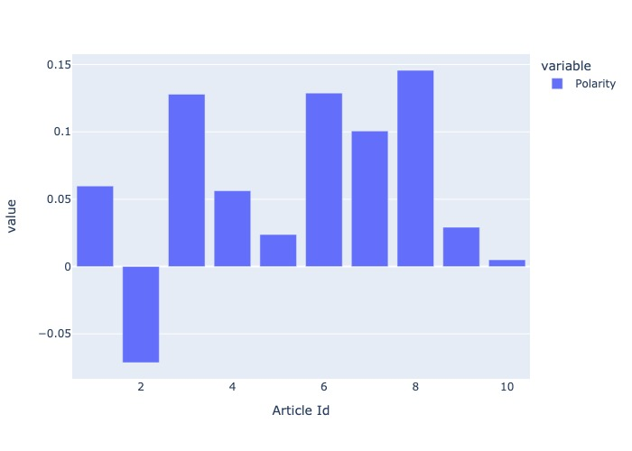
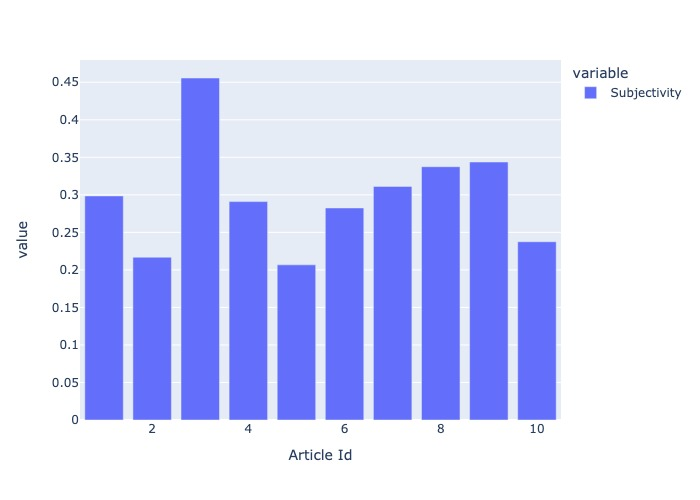

# News Articles Sentiment Analysis #

## FILE STRUCTURE ##
* articles.json : JSON file which contained the links for news articles.
* requirements.txt : Text file included the external packages and libraries required to run the code.
* main.py : Source code
* README.md : Document explaining the summary of results and instructions to run the code.
* pic1.jpg : Bar chart between articles and polarity scores.
* pic2.jpg : Bar chart between articles and subjectivity scores.

## SUMMARY ##

### Instruction to run code ###

```
pip3 install -r requirements.txt
python3 main.py
```

### Format of articles.json ###

```
{
    "articles" : [
                    {    
                        "article_id" : ...,
                        "article_link" : ...
                    },
                    ...
                  ]
}
```
### Run time ###

The run time of the file is 5.95957088470459 seconds.

### Web Scraping and Pre-processing ###

Load `articles.json` file using the json library.

Each news article is web scraped using the `requests` and `Beautiful Soup` library.

After extracting the text from the news article, the text is tokeninzed using the `Spacy` library. `Spacy` is a natural language processing library in Python. Using the english tokenizer and parser of spacy library, text is tokenized into sentences and unnecessary comments is removed.

Each sentences are preprocessed into text and it can be processed by the sentiment analysis library.

### Sentiment Analysis ###

TextBlob is a python library for Natural Language Processing (NLP).TextBlob actively used Natural Language ToolKit (NLTK) to achieve its tasks. NLTK is a library which gives an easy access to a lot of lexical resources and allows users to work with categorization, classification and many other tasks. TextBlob is a simple library which supports complex analysis and operations on textual data.

TextBlob returns polarity and subjectivity of a sentence. Polarity lies between [-1,1], -1 defines a negative sentiment and 1 defines a positive sentiment. Negation words reverse the polarity. TextBlob has semantic labels that help with fine-grained analysis. For example — emoticons, exclamation mark, emojis, etc. Subjectivity lies between [0,1]. Subjectivity quantifies the amount of personal opinion and factual information contained in the text. The higher subjectivity means that the text contains personal opinion rather than factual information. 

### Visualization ###

Each article is compared against the polarity and subjectivity scores of all sentences in the article. The polarity and subjectivity scores are calculated individually for each sentence. In the visulization plot, the mean of polarity of all sentences for each article is compared. The same goes for subjectivity plot as well. The visualization plot is drawn using `plotly` library.



<p align="center">
<b>ARTICLE ID vs POLARITY SCORE</b>
</p>



<p align="center">
<b>ARTICLE ID vs SUBJECTIVITY SCORE</b>
</p>

